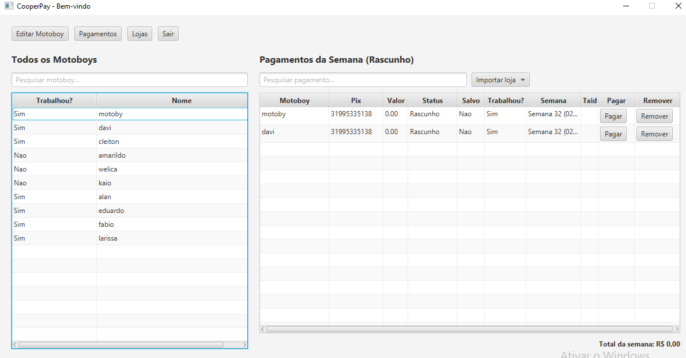

# CooperPay 

O **CooperPay** é um sistema Java para automação de pagamentos semanais em lote para colaboradores via API do Asaas.

Integrado ao **Hibernate/JPA**, o sistema cria e mapeia automaticamente o banco de dados na primeira execução. O projeto inclui um arquivo **`.bat`**, permitindo rodar a aplicação em qualquer computador sem precisar configurar Java ou banco de dados manualmente.

---

## Funcionalidades Principais

* **Pagamentos em Lote:** 
* **Integração com Asaas API:** 
* **Controle e Status de Pagamentos:**
* **Histórico e Persistência:** 

---

## 📸 Demonstração do Sistema

## Tecnologias Utilizadas

* **Java 17** 
* **Spring Boot 3.4.2** 
* **JavaFX 21 (Controls & FXML)** 
* **Spring WebFlux** .
* **Spring Data JPA & Validation** 

### **Banco de Dados & Ferramentas**
* **H2 Database** 
* **Lombok** 
* **Apache Maven** 
